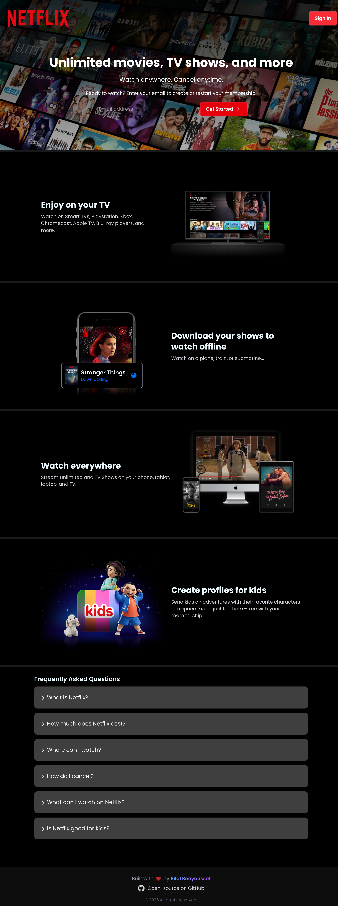
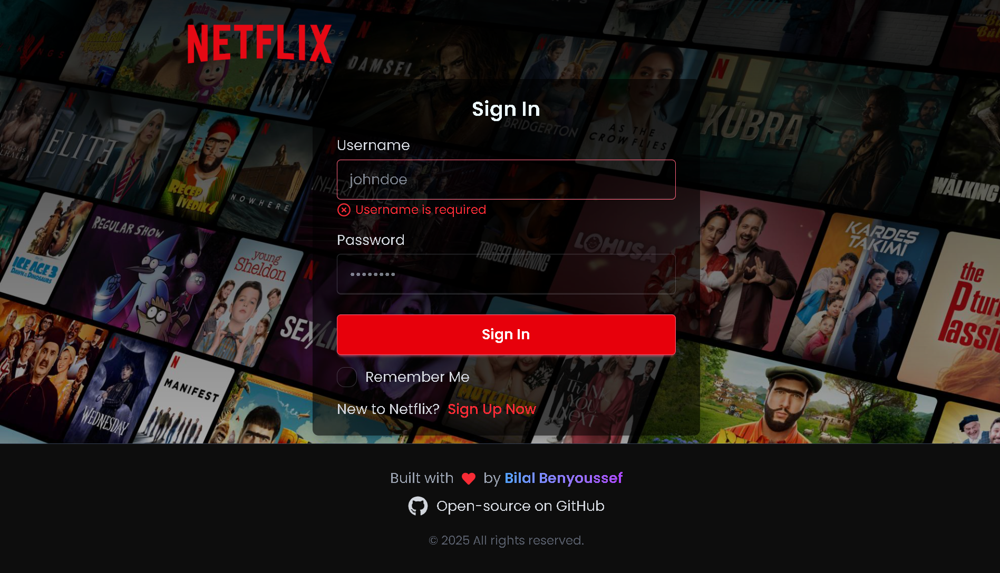
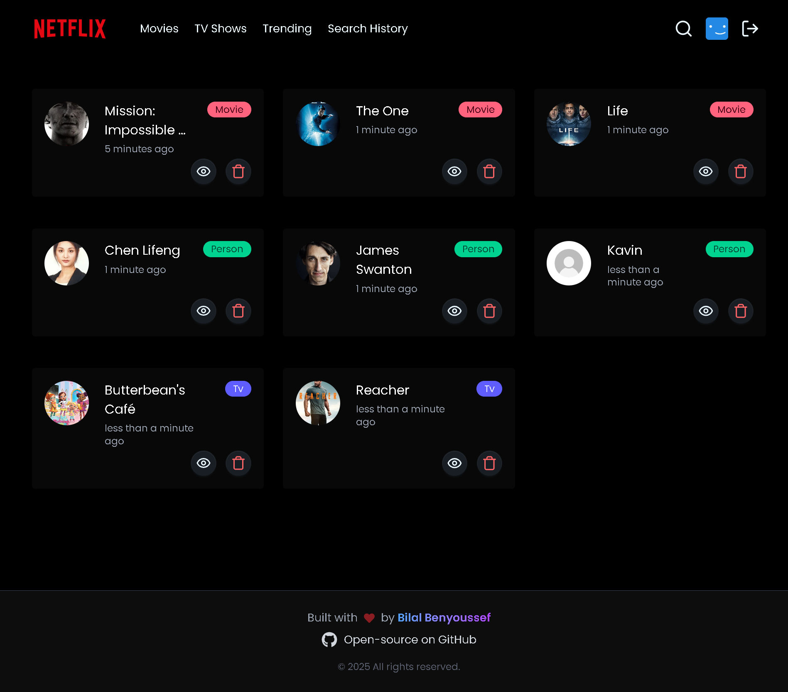

# Netflix Clone - MERN Stack

## 📌 Overview

This is a **full-stack Netflix Clone** built using the **MERN stack** (MongoDB, Express, React, Node.js). This project replicates key functionalities of Netflix, including authentication, movie browsing, searching, and watching trailers. It follows modern best practices, such as **React Query for caching**, **Redux Toolkit for state management**, and **JWT authentication** for secure user sessions.

---

## 🎯 Features

### 🚀 Backend (Node.js + Express + MongoDB)

- **User Authentication** (Signup, Login, Logout, JWT-based authentication)
- **Secure Password Handling** using **bcrypt** for hashing and comparing passwords
- **RESTful API** following MVC pattern
- **Authorization & Protected Routes** using **JWTs & Passport.js**
- **Data Validation** with **express-validator**
- **Fetching Movie Data** from **TMDB API** using **Axios** in the backend (to protect API keys)
- **Security Enhancements** using **CORS, Helmet, and JWT verification**
- **Database Interaction** using **Mongoose**
- **Development Monitoring** with **Nodemon**

### 🎨 Frontend (React + Vite + TailwindCSS)

- **User Authentication** (Login, Signup, Logout, and Token-based Authorization)
- **Protected Routes** using **React Router + JWT Authentication**
- **State Management** with **Redux Toolkit**
- **Global API Fetching & Caching** with **React Query**
- **Forms & Validation** using **Formik & Yup**
- **Optimized Image Handling** with **React-Image**
- **Movie & TV Show Trailers** using **React Player**
- **Skeleton Loading** for improved UX using **React Loading Skeleton**
- **Responsive UI & Styling** with **TailwindCSS + DaisyUI**
- **Carousels & Sliders** using **Swiper.js**
- **Search Functionality** (Search History, Trending Movies, etc.)
- **Date Formatting** using **Date-fns**
- **Accessible UI Components** with **React Accessible Accordion**
- **Error Handling & Notifications** with **React Hot Toast**

---

## 🏗️ Project Structure

### **Backend (Node.js + Express)**

```
backend/
├── src/
│   ├── controllers/     # Handle request logic and orchestrate between services & models
│   ├── models/          # Mongoose schemas and database models
│   ├── routes/          # API route definitions and route grouping
│   ├── middleware/      # Custom middlewares (auth, error handling, validation, etc.)
│   ├── config/          # Configuration files (DB, environment variables, external APIs)
│   ├── utils/           # Reusable helper functions (e.g., token generation, formatters)
│   └── server.mjs        # Main app setup and server start logic
├── .env                 # Environment variables (not committed)
├── package.json         # Backend scripts and dependencies
└── README.md            # Documentation for setup and usage
```

### **Frontend (React + Vite)**

```
frontend/
│── src/
│   ├── components/       # Reusable UI components
│   ├── pages/            # Page-specific components
│   ├── hooks/            # Custom hooks
│   ├── utils/            # Utility functions
│   ├── App.js            # Main App component
│   ├── main.jsx          # Entry point
│── public/               # Static assets
│── index.html            # Main HTML file
```

---

## 🛠️ Technologies Used

### **Backend:**

- **Node.js** + **Express.js**
- **MongoDB** + **Mongoose**
- **JWT Authentication** + **Passport.js**
- **Axios** (Server-side API Fetching from TMDB)
- **bcrypt** (Password Hashing)
- **express-validator** (Form Validation)
- **Helmet, CORS** (Security Enhancements)

### **Frontend:**

- **React.js (with Vite for fast development)**
- **Redux Toolkit** (State Management)
- **React Query** (API Caching & Mutations)
- **TailwindCSS + DaisyUI** (Styling & UI Components)
- **Axios + Axios Interceptor** (API Calls & Token Handling)
- **Formik + Yup** (Form Management & Validation)
- **React Hot Toast** (Notifications)
- **React Loading Skeleton** (Skeleton UI for better UX)
- **React Player** (YouTube Video Player for Trailers)
- **Swiper.js** (Carousels & Sliders)
- **React Accessible Accordion** (FAQs)
- **Date-fns** (Date Formatting)

---

## 🚀 Getting Started

### 📌 Prerequisites

- **Node.js** installed (v16+ recommended)
- **MongoDB** running locally or cloud (MongoDB Atlas)

### 🔧 Installation

#### 1️⃣ Clone the repository:

```bash
git clone https://github.com/Bilalben23/netflix-clone.git
cd netflix-clone
```

#### 2️⃣ Install dependencies:

##### Backend

```bash
npm install
```

##### Frontend

```bash
cd frontend
npm install
```

#### 3️⃣ Setup environment variables

Create a `.env` file in the **backend** directory and add (check `.env.example`):

```env
# Database Connection
MONGO_URI=mongodb+srv://<USERNAME>:<PASSWORD>@<CLUSTER>.mongodb.net/<DATABASE>?retryWrites=true&w=majority&appName=<APP_NAME>

# Server Port
PORT=5000

# JWT Secrets
REFRESH_SECRET_TOKEN=your_refresh_secret_here
ACCESS_SECRET_TOKEN=your_access_secret_here

# Environment
NODE_ENV=development

# TMDB API Key
TMDB_API_KEY=your_tmdb_api_key_here
```

#### 4️⃣ Run the backend server

```bash
npm run dev
```

#### 5️⃣ Run the frontend

```bash
cd frontend
npm run dev
```

#### 6️⃣ Open in the browser

```
http://localhost:5173/
```

---

## 🔥 Code Overview

### **Frontend Routing (React Router)**

```jsx
import { BrowserRouter, Route, Routes } from "react-router-dom";
import Layout from "./components/Layout";
import Signin from "./pages/auth/Signin";
import Signup from "./pages/auth/Signup";
import AuthLayout from "./components/AuthLayout";
import PersistLogin from "./components/PersistLogin";
import RedirectAuthenticatedRoute from "./components/RedirectAuthenticatedRoute ";
import HomeScreen from "./pages/home/HomeScreen";
import ProtectedRoute from "./components/ProtectedRoute";
import Watch from "./pages/Watch";
import SearchHub from "./pages/SearchHub";
import SearchHistory from "./pages/SearchHistory";
import NotFound from "./pages/NotFound";
import Trending from "./pages/Trending";
import Person from "./pages/Person";

export default function App() {
  return (
    <BrowserRouter>
      <Routes>
        {/* Protected Home (only for authenticated users) */}
        <Route element={<PersistLogin />}>
          <Route path="/" element={<Layout />}>
            <Route index element={<HomeScreen />} />

            <Route element={<ProtectedRoute />}>
              <Route path="/search" element={<SearchHub />} />
              <Route path="/trending" element={<Trending />} />
              <Route path="/history" element={<SearchHistory />} />
              <Route path="/watch/:id" element={<Watch />} />
              <Route path="/person/:id" element={<Person />} />

              {/* protected routes goes here... */}
            </Route>
          </Route>

          <Route element={<RedirectAuthenticatedRoute />}>
            <Route element={<AuthLayout />}>
              <Route path="/signin" element={<Signin />} />
              <Route path="/signup" element={<Signup />} />
            </Route>
          </Route>
        </Route>

        {/* NotFound Route (Catch-All) */}
        <Route path="*" element={<NotFound />} />
      </Routes>
    </BrowserRouter>
  );
}
```

---

## 🎯 Future Enhancements

- ✅ Add **User Profiles & Preferences**
- ✅ Implement **Infinite Scrolling**
- ✅ Add **Dark Mode Toggle**
- ✅ Implement **WebSockets for Real-time Updates**

---

## 🤝 Contributing

Contributions are welcome! Feel free to submit **issues** and **pull requests**.

---

## 📞 Contact

**LinkedIn**: [Bilal Benyoussef](www.linkedin.com/in/bilal-benyoussef-b38a27251)

---

## 📸 Screenshots

### 🏠 Homepage (Before Login)



### 🔐 Login Page



### 🎬 Movies Page


### 📺 TV Shows Page


### 📈 Trending Page


### 🔍 Search Page


### 🕘 Search History


